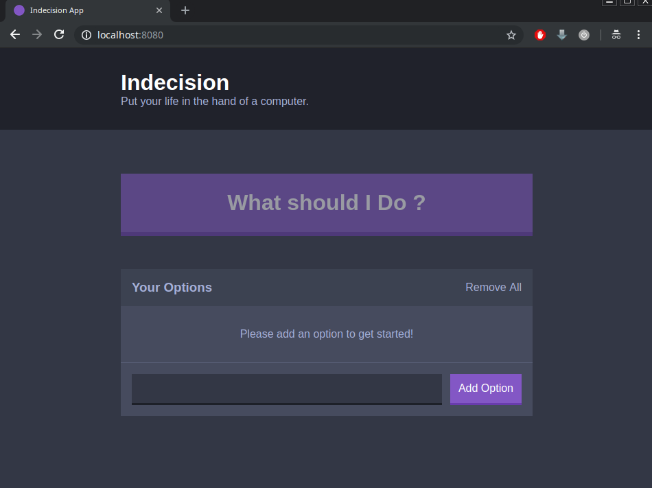

## Project to get start with [ReactJS](https://reactjs.org/)

The app is basically a TODO list with a random chooser

### Setup

- [yarn](https://yarnpkg.com)
- [babel](https://babeljs.io)
- [webpack](https://webpack.js.org)

### To run locally

1 - Clone the project

```bash
git clone https://github.com/fredericomartini/indecision-app.git

```

2 - Enter in the project folder and install dependencies

```bash
yarn install
```

3 - Run the dev-server

```bash
yarn run dev-server
```

It`s ready! :D


